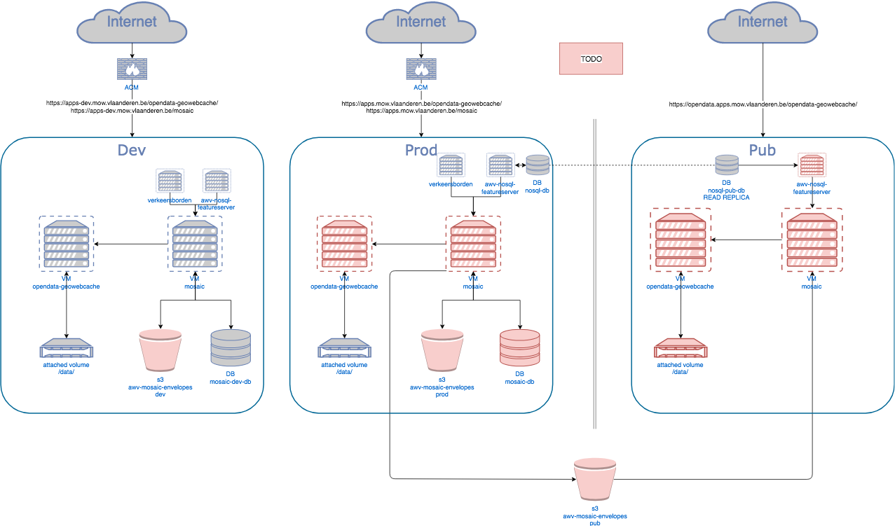

# Mosaic

## Architectuur

[Link naar laatste versie architectuurdiagramma](https://drive.google.com/file/d/1KqRnKhuCO_8MxiXwb0ElCmtxnSd9_Qo1/view)

#### Algemeen

De taken van Mosaic:
  - aanbieden van een WMS stack om opstellingen te renderen
  - de verkeersborden feed uitlezen om de tiles die een verouderde voorstelling van de opstelling bevat te verwijderen
  - 's nachts automatisch de gebieden reseeden die geinvalideerd werden

#### Feed uitlezen

Om de te invalideren gebieden te bepalen leest Mosaic de [verkeersborden feed](https://apps.mow.vlaanderen.be/verkeersborden/rest/events/zi/verkeersborden/feed) uit van de Verkeersborden applicatie.

We willen echter verhinderen dat er gebieden geinvalideerd worden waarvan de data nog niet in Featureserver is geupdatete door Dataloader. Om dit te 
verhinderen wordt de [syncstatus van Dataloader](https://apps.mow.vlaanderen.be/dataloader/syncstatus) uitgelezen . 

Indien de Dataloader de entry in de feed nog niet verwerkt heeft (pagina van
syncstatus is lager dan de feedpointer van Mosaic of de laatste verwerkte entry van Dataloader staat lager op de feed pagina dan die
van Mosaic), zullen we wachten om de te invalideren envelope weg te schrijven.

De envelopes in de feed van Verkeersborden bevat de bounding box van de opstelling locatie en al zijn aanzicht ankerpunten. De feed van 
Verkeersborden werd uitgebreid om zowel de vroegere bounding box van de opstelling als de vernieuwde bounding box te bevatten (dit kan 
bij bvb een verplaatsing van de opstelling of van 1 van zijn ankerpunten). 

#### PROD & PUB

De geowebcache instantie die voor Mosaic zal draaien dient ook als opendata URL te ontsloten worden. Dwz dat Geowebcache, Mosaic en de 
Featureserver ook in het PUB segment dienen te draaien. De PUB omgeving kan echter niet aan de PROD omgeving. Mosaic-PUB dient echter
te weten wanneer een bepaald gebied verouderde tiles bevat van opstellingen die recent aangepast worden. 

Om dit te voorzien werd er gekozen om via een S3 bucket te communiceren. Om de werking van beide versies van Mosaic zo gelijkmogelijk te 
houden zal Mosaic-PROD ook uit een bucket lezen om zijn cache te invalideren. 

Mosaic-PROD schrijft dus alle te invalideren envelopes weg naar 2 buckets. 
Een 'prod' bucket en een 'pub' bucket. Mosaic-PROD leest alle te invalideren envelopes uit de 'prod' bucket. Na invalidatie wordt de envelope file verwijderd. 

Mosaic-PUB leest alle te invalideren envelopes uit de 'pub' bucket. Mosaic-PUB schrijft uiteraard zelf geen envelopes weg. De configuraties van beide
omgevingen:

##### Configuratie van PROD
  
    mosaic:
      s3:
        bucket: 'awv-mosaic-envelopes'
        prefix:
          reader: 'prod'
          writers: 'prod,pub'

##### Configuratie van PUB
  
    mosaic:
      s3:
        bucket: 'awv-mosaic-envelopes'
        prefix:
          reader: 'pub'
          writers: ''

De buckets zijn hier te raadplegen: https://s3.console.aws.amazon.com/s3/home?region=eu-west-1#
#####TODO: Pas url aan? bucket bestaat nog niet?

#### Verkeersbordrendering

Bij het ophalen van de te renderen opstellingen van een tile, dienen niet enkel de opstellingen die in een tile liggen opgehaald te worden,
maar ook alle opstellingen waarvan een grafisch element in de desbetreffende tile kan liggen. Hiervoor gebruiken we een bounding box factor
waarmee we de bounding box breedte en hoogte zullen vermenigvuldigen. Hoe hoger het zoomniveau, hoe hoger deze bounding box factor zal zijn.
De configuratie van die factor is terug te vinden in mapserver.conf.

      bboxFactors = {
        "2.0" = 1.05 // opstelling als punt
        "1.0" = 1.05 // opstelling als punt
        "0.5" = 1.1 // opstelling met hoek (iets buiten bounding box voor hoeklijn)
        "0.25" = 3.5 // opstelling met aanzicht klein
        "0.125" = 7.0 // opstelling met aanzicht groot
        "0.0625" = 7.5 // opstelling met aanzicht groot
        "0.03125" = 7.5 // opstelling met aanzicht groot
      }

Om te verhinderen dat de op te halen opstellingen een te grote bounding box vereisen, werd er geopteerd om de opstelling rendering voor
de grootste opstellingen aan te passen. Zo wordt de afstand van ankerpunt naar opstelling beperkt tot 75 meter op het eerste zoomniveau
waar de aanzichten zichtbaar zijn. Voor alle volgende zoomniveau's wordt de grafische lengte van de verbindingslijn gelijk gehouden.
Bovendien wordt de maximum grootte van een aanzicht ook beperkt tot 50 meter. 

Dit alles zorgt ervoor dat grote aanzichten of aanzichten die ver van een opstelling staan of, lichtjes anders voorgesteld worden in 
vergelijking met de de grafische voorstelling in de Verkeersborden of Wegendatabank applicatie.

##### Geowebcache

De configuratie van Geowebcache die naar Mosaic wijst kan u hier vinden: [geowebcache.xml](https://collab.mow.vlaanderen.be/gitlab/Rood/opendata-geowebcache/blob/develop/geowebcache.xml)

###### Metatiling

Vermits de opstelling renderer reeds meer opstellingen ophaalt om te verzekeren dat opstellingen die buiten de tile liggen maar toch 
gedeeltelijk op de tile getekend worden, is de meta tiling van Geowebcache redundant. Deze wordt dan ook uitgeschakeld in [geowebcache.xml](https://collab.mow.vlaanderen.be/gitlab/Rood/opendata-geowebcache/blob/develop/geowebcache.xml).

    <metaWidthHeight> <!-- default 3x3 metatiling af, mosaic doet dit al voor ons (boundingBoxFactor 3) -->
        <int>1</int>
        <int>1</int>
      </metaWidthHeight>

###### Browser cache expiration

Standaard voorziet Geowebcache een browser tile cache timeout van 1 uur - de browser zal pas een nieuwe request voor dezelfde tile 
uitvoeren reeds aanwezige opgehaalde tile in de browsercache ouder is dan 1 uur. Indien de gebruiker echter een opstelling heeft aangepast, zal de nieuwe
voorstelling pas verschijnen na 1 uur. Om deze delay te voorkomen werd geopteerd om op de diepere zoomniveau's waar de aanzichten zichtbaar 
zijn, de browser expiration te verkleinen naar 10 minuten.

      <expireClientsList>
        <expirationRule minZoom="0" expiration="14400" /> <!-- browser expiration voor opstelling en aanzicht punten op 4 uur -->
        <expirationRule minZoom="12" expiration="600" />  <!-- browser expiration voor borden op 10 minuten -->
      </expireClientsList>

### Git subtrees

De verkeersbordrendering en WMS stack maakt gebruik van de geolatte-maprenderer en -mapserver. Deze werden als
subtrees toegevoegd aan het project om makkelijk de laatste nieuwe changes te syncen naar dit project.

### Voeg remote repo's toe
    git remote add geolatte-geom git@github.com:GeoLatte/geolatte-geom.git
    git remote add geolatte-maprenderer git@github.com:GeoLatte/geolatte-maprenderer.git
    git remote add geolatte-mapserver git@github.com:GeoLatte/geolatte-mapserver.git

### Initiëel toevoegen van subtree aan project
    git subtree add --prefix=modules/geolatte-geom geolatte-geom transform --squash
    git subtree add --prefix=modules/geolatte-maprenderer geolatte-maprenderer master --squash
    git subtree add --prefix=modules/geolatte-mapserver geolatte-mapserver master --squash

### Wijzigingen binnentrekken van subtrees
    git fetch geolatte-geom transform
    git fetch geolatte-maprenderer master
    git fetch geolatte-mapserver master

    git subtree pull --prefix=modules/geolatte-geom geolatte-geom transform --squash
    git subtree pull --prefix=modules/geolatte-maprenderer geolatte-maprenderer master --squash
    git subtree pull --prefix=modules/geolatte-mapserver geolatte-mapserver master --squash
